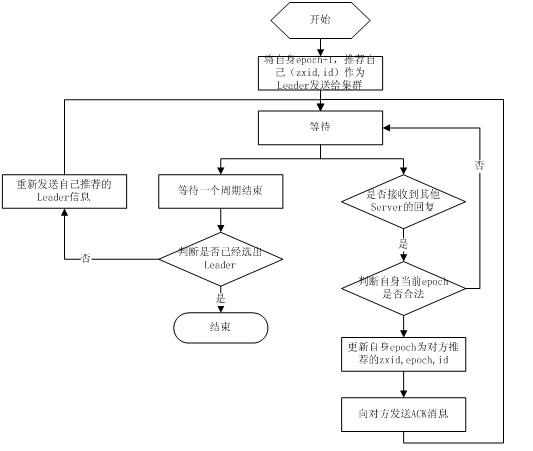

* content
{:toc}

## 简介

ZooKeeper 是一个分布式协调系统，Google Chubby 的开源实现

提供的功能包括：**配置集中管理/动态更新，命名服务，负载均衡，分布式同步，分布式锁，分布式队列，分布式协调/通知，集群管理** 

## ZooKeeper 的基本概念

### ZooKeeper 集群角色
- Leader 负责进行投票的发起和决议，更新系统状态
- Follower 用于接收客户请求并返回结果，参与 Leader 选举
- Observer 可以接收客户请求并返回结果，但不参与选举

> 另一个 Client 角色不属于集群，即发送请求的一方

需要注意的是，一个 ZK 集群，同一时刻只有一个Leader，其他都是Follower 或 Observer


### zoo.cfg 配置文件

ZooKeeper 的配置很简单，每个节点的配置文件都一样，只有各自的 myid 不一样，即在 zoo.cfg 中 server.{number} 中的{number} 部分不样，用于标识各个节点


```
maxClientCnxns=0
# The number of milliseconds of each tick
tickTime=2000
# The number of ticks that the initial
# synchronization phase can take
initLimit=10
# The number of ticks that can pass between
# sending a request and getting an acknowledgement
syncLimit=5
# the directory where the snapshot is stored.
dataDir=/var/lib/zookeeper/data
# the port at which the clients will connect
clientPort=2181
# the directory where the transaction logs are stored.
dataLogDir=/var/lib/zookeeper/logs
server.1=192.168.20.101:2888:3888
server.2=192.168.20.102:2888:3888
server.3=192.168.20.103:2888:3888
server.4=192.168.20.104:2888:3888
server.5=192.168.20.105:2888:3888
minSessionTimeout=4000
maxSessionTimeout=100000
```

默认 ZooKeeper 是没有 Observer 的，需要时在配置文件中标识出 Observer 节点: `peerType=observer`

并在所有server的配置文件中，配置成observer模式的server的那行配置追加:observer，例如：`server.1:localhost:2888:3888:observer`


> 在装有 ZooKeeper 的机器的终端执行 zookeeper-server status 可以看当前节点的 ZooKeeper 是什么角色（Leader or Follower）
```
[root@node-20-103 ~]# zookeeper-server status
JMX enabled by default
Using config: /etc/zookeeper/conf/zoo.cfg
Mode: follower

[root@node-20-104 ~]# zookeeper-server status
JMX enabled by default
Using config: /etc/zookeeper/conf/zoo.cfg
Mode: leader
```

### 节点
节点有两类

- 集群中的一台机器就叫做一个节点
- 还有就是树形数据单元中的Znode也叫一个节点，有持久节点和临时节点

### 节点读写服务分工

- ZooKeeper 集群所有机器通过一个选举过程选出一个 Leader，Leader 为客户提供读**写**服务，
- Follower 和 Observer 只提供读服务，当接收到写服务的请求时，将这个请求转发给 Leader

### 数据节点（ZNode）
在谈到分布式的时候，**一般『节点』指的是组成集群的每一台机器**。**而ZooKeeper中的数据节点是指数据模型中的数据单元，称为ZNode**。ZooKeeper将所有数据存储在内存中，数据模型是一棵树（**ZNode Tree**），由斜杠（/）进行分割的路径，就是一个ZNode，如/hbase/master,其中hbase和master都是ZNode。每个ZNode上都会保存自己的数据内容，同时会保存一系列属性信息。

注：
这里的ZNode可以理解成既是Unix里的文件，又是Unix里的目录。因为每个ZNode不仅本身可以写数据（相当于Unix里的文件），还可以有下一级文件或目录（相当于Unix里的目录）。

在ZooKeeper中，ZNode可以分为持久节点和临时节点两类。

**持久节点**
- 所谓持久节点是指一旦这个ZNode被创建了，除非主动进行ZNode的移除操作，否则这个ZNode将一直保存在ZooKeeper上。

**临时节点**
- 临时节点的生命周期跟客户端会话绑定，一旦客户端会话失效，那么这个客户端创建的所有临时节点都会被移除。

### Watcher
Watcher（事件监听器），是ZooKeeper中一个很重要的特性。ZooKeeper允许用户在指定节点上注册一些Watcher，并且在一些特定事件触发的时候，ZooKeeper服务端会将事件通知到感兴趣的客户端上去。该机制是ZooKeeper实现分布式协调服务的重要特性。

### ZAB (ZooKeeper Atomic Broadcast) 协议 & 选举

ZAB 协议保证了各个 Server 之间的同步

ZAB 协议有两个模式
- 恢复模式：服务启动或者现任 Leader 崩溃，ZAB 进入恢复模式，选举新的 Leader，选举出新 Leader 之后，当大多数 Server 完成和 Leader 的同步后，恢复模式就结束了。
- 广播模式：状态同步，保证 Leader 和 Server 有相同的系统状态

为了保证**事务的顺序一致性**，Zookeeper 采用了**递增的事务id zxid (一个64位数字)** 来标识每个事务，所有的 proposal 都在被提出时加上了 zxid

> 所有事务请求必须由一个全局唯一的服务器来协调处理，这样的服务器被称为Leader服务器，而剩下的其他服务器则成为Follower服务器。Leader服务器负责将一个客户端事务请求转换成一个事务Proposal（提案）并将该Proposal分发给集群中所有的Follower服务器。之后Leader服务器需要等待所有Follower服务器的反馈，一旦超过半数的Follower服务器进行了正确的反馈后，Leader就会再次向所有的Follower服务器分发Commit消息，要求对刚才的Proposal进行提交。

每个Server 在工作时有三种状态
- LOOKING：当前Server不知道leader是谁，正在搜寻
- LEADING：当前Server即为选举出来的leader
- FOLLOWING：leader已经选举出来，当前Server与之同步

选举流程：


## 数据发布与订阅（配置中心）
数据发布与订阅，即所谓的配置中心，顾名思义就是发布者将数据发布到ZooKeeper节点上，供订阅者进行数据订阅，进而达到动态获取数据的目的，实现配置信息的集中式管理和动态更新。

在我们平常的应用系统开发中，经常会碰到这样的需求：系统中需要使用一些通用的配置信息，例如机器列表信息、数据库配置信息等。这些全局配置信息通常具备以下3个特性。

- 数据量通常比较小
- 数据内容在运行时动态变化
- 集群中各机器共享，配置一致

对于这样的全局配置信息就可以发布到ZooKeeper上，让客户端（集群的机器）去订阅该消息。
发布/订阅系统一般有两种设计模式，分别是推（Push）和拉（Pull）模式。

- 推：服务端主动将数据更新发送给所有订阅的客户端。
- 拉：客户端主动发起请求来获取最新数据，通常客户端都采用定时轮询拉取的方式。

ZooKeeper采用的是**推拉相结合**的方式。如下：

客户端想服务端注册自己需要关注的节点，一旦该节点的数据发生变更，那么服务端就会向相应的客户端发送Watcher事件通知，客户端接收到这个消息通知后，需要主动到服务端获取最新的数据（推拉结合）

## 命名服务 (Naming Service)
命名服务也是分布式系统中比较常见的一类场景。在分布式系统中，通过使用命名服务，客户端应用能够根据指定名字来获取资源或服务的地址，提供者等信息。被命名的实体通常可以是集群中的机器，提供的服务，远程对象等等——这些我们都可以统称他们为名字（Name）。其中较为常见的就是一些分布式服务框架（如RPC、RMI）中的服务地址列表。通过在ZooKeepr里创建顺序节点，能够很容易创建一个全局唯一的路径，这个路径就可以作为一个名字。

ZooKeeper的命名服务即生成全局唯一的ID。

## 分布式锁
分布式锁是控制**分布式系统**之间**同步访问共享资源**的一种方式。

分布式锁又分为**排他锁**和**共享锁**两种。

### 排他锁
排他锁（Exclusive Locks，简称X锁），又称为写锁或独占锁。
>如果事务T1对数据对象O1加上了排他锁，那么在整个加锁期间，只允许事务T1对O1进行读取和更新操作，其他任何事务都不能在对这个数据对象进行任何类型的操作（不能再对该对象加锁），直到T1释放了排他锁

### 共享锁
>共享锁（Shared Locks，简称S锁），又称为读锁。如果事务T1对数据对象O1加上了共享锁，那么T1只能对O1进行读操作，其他事务也能同时对O1加共享锁（不能是排他锁），直到O1上的所有共享锁都释放后O1才能被加排他锁